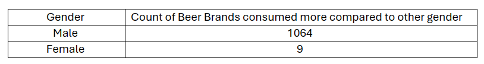
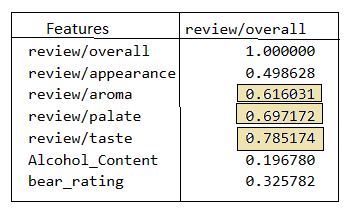

# Beer Analysis Project

Namaste All! In this Repository I have created several machine Learning based models for beer quality analysis
The objective of this repository includes:
1. Feature Engineering of Dependent Variables in Beer Dataset
2. Create both categorical and regressive models
3. Analyse performance of various models

Dataset used in the project is available in repository.

Features:
Describe the features or variables used in the analysis.
Explain what each feature represents and its significance in the analysis.
Data Preprocessing:

Outline the steps taken to preprocess the data, including:
Handling missing values
Encoding categorical variables
Scaling/normalizing numerical features
Splitting the data into training and testing sets
Exploratory Data Analysis (EDA):

Summarize the insights gained from exploratory data analysis, such as:
Distribution of target variable
Correlation between features
Any interesting patterns or trends observed in the data
Machine Learning Models:

Describe the machine learning models used in the analysis, such as:
Decision Trees
Random Forests
Linear Regression
Any other models relevant to your analysis
Explain the rationale behind choosing these models.
Model Training and Evaluation:

Outline the steps taken to train and evaluate the models, including:
Training process
Evaluation metrics used (e.g., accuracy, RMSE, R-squared)
Results obtained from each model

## Conclusion

### Summarize the key findings and insights from the analysis
- Male are dominant consumers of most of the bears in available dataset. While 1064 bears dominantly are consumed by males only 9 beers are dominantlly consumed by females.
- 
- The correlation plot shows strong correlation between some of the dependent variables with independent variables. The correlation is depicted below.
- 
- Although 'Alcohol/Content' do not significantly affect the results though the correlation is poor for these features.
- The correlation of 'review/text' feature is also poor analysed through sentiment analysis
- 
Discuss any challenges faced during the project and how they were addressed.
Mention potential future work or improvements to the analysis.

## Dependencies required to run the project

- [Flask : 2.1.2](https://palletsprojects.com/p/flask/) - Depolyed python project application
- [Pandas : 1.4.2](https://pandas.pydata.org/docs/reference/api/pandas.DataFrame.html) - Handling large dataframes
- [Numpy : 1.22.4](https://numpy.org/) - Manipulating data to get data in alignment with requirements
- [Matplotlib : 3.5.2](https://matplotlib.org/) - Plot effective visualisations
- [Plotly : 5.8.0](https://plotly.com/) - Plot effective visualisations
- [Seaborn : 0.11.2](https://seaborn.pydata.org/) - Plot effective visualisations
- [Scikit-learn : 1.1.1](https://scikit-learn.org/stable/) - Machine learning algoritms
- [NTLK : 3.8.1](https://www.nltk.org/) - Sentiment Aanalysis Toolkit

## Installation
### Requirements
- python 3.x
- 
### Run the project
- Clone the git repo
- In terminal run pip intsall requirements.txt
- place all the static files and templates in venv with app.py
- Run python app.py

# Project Development Strategy
I divided my whole task into two days task bundle and proceeded, step by step from learning, building and deploying the project. Whatever I learned, explored, researched during this program is fully detailed in tables below:
Link : https://docs.google.com/spreadsheets/d/1idKzuLYCOCJlQ_GF3UNA_uQfycd10-jW/edit?usp=sharing&ouid=103635047232343090927&rtpof=true&sd=true 

